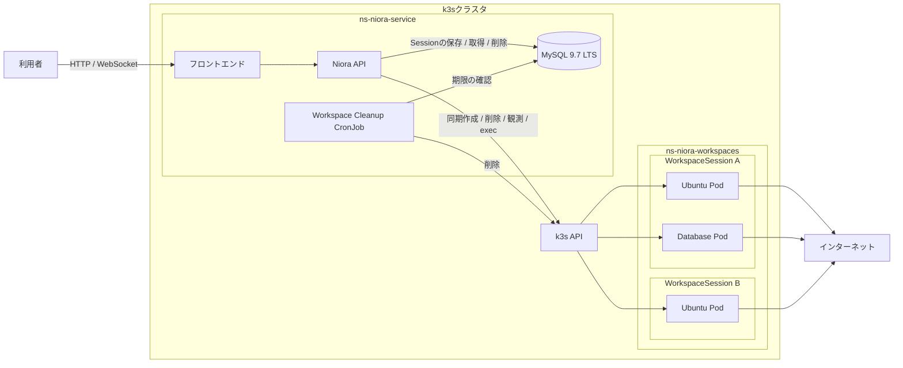
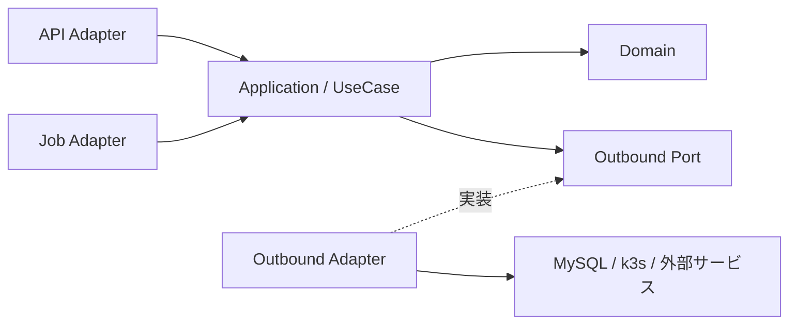

# アーキテクチャ

Nioraの現在のシステム構成、境界、依存関係を示します。

このファイルには現在採用している構成だけを記載します。判断の背景、代替案、影響、変更履歴は[アーキテクチャ決定記録（ADR）](adr/README.md)で管理します。

## 全体構成

全体をモジュラーモノリスとして構成し、APIとWorkspace Cleanup CronJobは同じコードベースとビルド成果物を
利用します。詳細は[ADR 0003](adr/0003-use-modular-monolith.md)を参照してください。

## モジュール境界

Niora APIを次のドメインモジュールに分割します。

| モジュール | 責務 |
| --- | --- |
| `Textbook` | 教科書と章 |
| `Workspace` | WorkspaceSessionのライフサイクル、接続権限、接続、実行環境との連携 |
| `Auth` | 外部認証との連携、利用者、権限 |

`Auth`は全体構成に含めますが、v0.0.1では実装しません。モジュール間は公開されたApplicationインターフェースを通じて連携します。

## 依存関係

各モジュールはクリーンアーキテクチャの依存性ルールに従います。

DomainとApplicationは外部技術に依存せず、MySQL、k3s、外部認証、接続方式との差分をAdapterで吸収します。詳細は[ADR 0004](adr/0004-use-clean-architecture.md)を参照してください。

Workspace Domainは、実行環境の定義を不変なWorkspaceDefinition、Definition IDと有効期限を持つ利用単位をWorkspaceSessionとして
扱います。また、WorkspacePresetKeyと完成済みWorkspaceDefinitionを組にしたWorkspacePresetをDomain Modelとします。
システム提供Workspace presetは、Workspace固有のJSON Catalog（`catalog/system/workspace/presets.json`）でGit管理し、
`scripts/seed_system_catalog.py`の`WorkspacePresetCatalogLoader`が構造を検証して`WorkspacePresetCatalog`へ変換します。
`WorkspacePresetCatalogDiffer`がDatabaseとの差分をinsert・unchangedへ分類し、`WorkspacePresetCatalogApplier`がTable Modelへ直接seedします。
Domainは具体的なsystem presetの値を保持しません。
ApplicationはWorkspaceDefinitionとWorkspaceSessionの永続化、およびRuntimeへの同期操作を調整します。AdapterはMySQLへの永続化、
k3sへの操作、接続方式を実装します。詳細は
[ADR 0016](adr/0016-apply-workspace-synchronously-and-clean-up-expired-resources.md)を参照してください。

API AdapterにはFastAPIを使用します。APIのバージョン、ドメインrouter、Schema、依存性注入の構成は
[API実装規約](api.md)に従います。

## データ

教科書と章などの永続データにはMySQL 9.7 LTSを使用します。各モジュールは同じデータベースを利用し、データの所有境界を
分けます。Database SchemaはSQLAlchemy 2.x ORMのDeclarative Mappingで定義します。共通のDeclarative Base、`MetaData`、
Constraint命名規則はShared Infrastructureに配置し、Module固有のTable Modelは所有するModuleのInfrastructureに配置します。
Shared InfrastructureにはModule固有のTable Modelを配置しません。

PyMySQLを使用する各モジュールの外部実装からDatabaseへ接続します。Transaction境界はUseCaseが担い、1回のUseCase実行を
1つのUnit of Workとします。DomainとApplicationはMySQL、SQLAlchemy、PyMySQLへ依存しません。データベースの選定は
[ADR 0005](adr/0005-use-mysql-9.7-lts.md)、接続、Transaction、Migrationの方式は
[ADR 0008](adr/0008-use-sqlmodel-pymysql-and-alembic.md)、SQLAlchemyとTable Modelの所有境界は
[ADR 0012](adr/0012-use-sqlalchemy-and-separate-database-infrastructure.md)を参照してください。

Chapterは対応する実行環境をWorkspacePresetKeyで参照します。WorkspacePresetは、WorkspacePresetKeyと完成済みの
WorkspaceDefinitionを組として保持するDomain Modelです。どのPresetを、どのKeyとDefinitionで提供するかは、開発者がWorkspace固有JSON
Catalogへ記述します。WorkspacePresetCatalogLoaderは、Catalogの各項目をWorkspacePresetへ変換して検証済みCatalogを作成します。
Catalogの項目を省略しても、Databaseに登録済みの項目を削除する意味にはなりません。
初期登録は`make migrate`後、APIまたはCleanup CronJobの起動前に`make seed-system-catalog`を単独実行します。seed scriptは個別のPreset定義や
Catalog件数に依存せず、検証済みCatalogからPresetを取得します。

Preset Key、WorkspaceDefinition、および対応表はCatalogから読み込んだ不変なDomainデータとして扱います。

seed scriptはCatalogから全Presetを取得し、Definition、Component、Terminal、Preset mappingをMySQLへ直接保存します。
Workspace作成時はDomainのProviderやCatalogではなくMySQLに保存した対応だけを利用します。Preset入力Model、外部からPresetを取得するPort、
およびPresetごとのApplication登録入力は設けません。

初期登録はSchema Migration後、APIまたはCleanup CronJobの起動前に`make seed-system-catalog`を単独実行します。
Alembicのdata migrationやApplication起動時の自動seedには含めず、Textbookの開発データ投入とも分離します。未登録値は追加し、
完全一致する再登録は何も変更せず、既存値との不一致はCatalog全体をrollbackします。Catalogから省略した項目は削除しません。

将来ユーザー定義環境を追加する場合はPresetとは別のUseCaseでWorkspaceDefinitionを作成し、UserまたはChapter固有の情報と
Definition IDを関連付けます。供給元ごとの入力形式は共通化せず、保存後は同じWorkspaceDefinition Repositoryを利用します。

WorkspaceDefinition、WorkspacePresetKeyからDefinition IDへの対応、およびWorkspaceSessionをMySQLへ永続化します。
WorkspaceSessionはApplicationがRuntime操作前に保存するmetadataであり、k3s上の実行環境との一致を保証しません。k3s上のリソースを
observed stateの正とし、Podなどの実行状態をMySQLへ複製しません。WorkspaceDefinitionまたはWorkspaceSessionをk3s Metadataから
復元せず、k3s Metadataは実行中リソースの識別と期限Cleanupにのみ使用します。詳細は
[ADR 0016](adr/0016-apply-workspace-synchronously-and-clean-up-expired-resources.md)を参照してください。

WorkspaceSessionは作成時に解決したWorkspaceDefinitionのDefinition IDを不変に保持します。WorkspacePresetKeyからDefinition IDへの
対応はWorkspace作成時のDefinition選択にだけ使用し、作成済みSessionの解決には使用しません。Sessionが存在してもRuntime作成が
成功したことは保証せず、Runtimeの欠損をAPIが再作成しません。

WorkspaceDefinitionは1件以上のWorkspaceComponentで構成し、各Componentは識別子、OCI Image参照、任意の起動コマンド、
任意のTerminal exec接続点を持ちます。OCI Image参照はTagまたはDigestへ制限せず、実際に展開されたImage IDやDigestは
k3sからobserved stateとして取得します。

## k3s

| Namespace | 配置するもの |
| --- | --- |
| `ns-niora-service` | フロントエンド、Niora API、MySQL、Workspace Cleanup CronJob |
| `ns-niora-workspaces` | WorkspaceSessionに対応する実行環境のPod群と付随するリソース |

すべてのWorkspaceSessionに対応する実行環境は`ns-niora-workspaces`を共有し、LabelとNetworkPolicyで相互の通信を分離します。詳細は[ADR 0006](adr/0006-share-k3s-workspace-namespace.md)を参照してください。

APIから呼び出されたApplicationは、MySQL実装のResolverを通してPresetKeyに対応するDefinition IDを解決し、そのIDを持つ
WorkspaceSessionをMySQLへCommitした後、SessionとDefinitionを指定してRuntimeへ同期作成を一度だけ要求します。Runtime作成が
失敗してもSessionや作成途中のリソースをAPIが補償・再試行・再作成しません。明示的な終了では、期限内のSessionに限りRuntime削除を
一度だけ要求し、成功後にSessionをMySQLから削除します。期限切れSessionはCleanup CronJobが回収します。詳細は
[ADR 0016](adr/0016-apply-workspace-synchronously-and-clean-up-expired-resources.md)を参照してください。

ブラウザとNiora APIの間はWebSocket、Niora APIと実行環境の間はk3s APIのPod `exec`で接続します。Connectionが切断されても
WorkspaceSessionと実行環境は維持します。詳細は[ADR 0007](adr/0007-run-workspaces-as-pods.md)を参照してください。

## 外部との境界

- 利用者からバックエンド機能へのアクセスはNiora APIを経由する
- MySQLとk3s APIを利用者へ公開しない
- WorkspaceSessionの実行環境への接続をNiora APIが中継する
- WorkspaceSession間の通信を禁止し、同じWorkspaceSessionの実行環境内にあるPod間通信を許可する
- 実行環境からインターネットへの通信を許可し、Nioraの基盤への通信を禁止する
