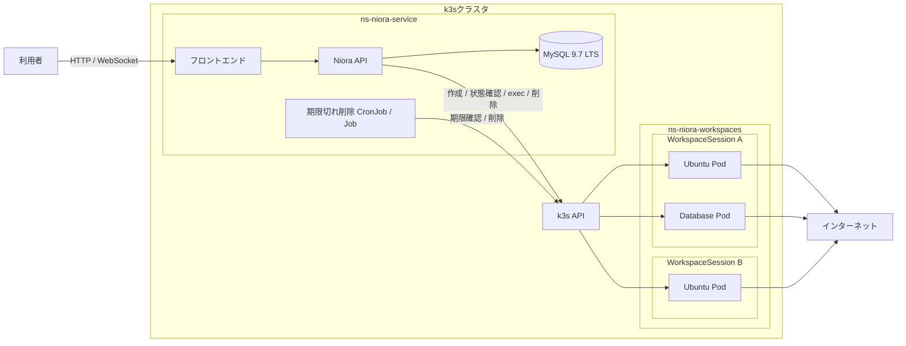
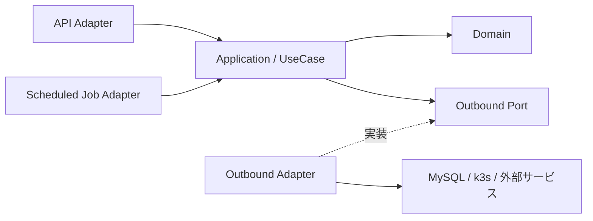

# アーキテクチャ

Nioraの現在のシステム構成、境界、依存関係を示します。

このファイルには現在採用している構成だけを記載します。判断の背景、代替案、影響、変更履歴は[アーキテクチャ決定記録（ADR）](adr/README.md)で管理します。

## 全体構成

全体をモジュラーモノリスとして構成し、APIと期限切れ削除Jobは同じコードベースとビルド成果物を利用します。詳細は[ADR 0003](adr/0003-use-modular-monolith.md)を参照してください。

## モジュール境界

Niora APIを次のドメインモジュールに分割します。

| モジュール | 責務 |
| --- | --- |
| `Textbook` | 教科書と章 |
| `Workspace` | WorkspaceSessionのライフサイクル、接続権限、接続、実行環境との連携 |
| `Auth` | 外部認証との連携、利用者、権限 |

`Auth`は全体構成に含めますが、v0.0.1では実装しません。モジュール間は公開されたApplicationインターフェースを通じて連携します。

## 依存関係

各モジュールはクリーンアーキテクチャの依存性ルールに従います。

DomainとApplicationは外部技術に依存せず、MySQL、k3s、外部認証、接続方式との差分をAdapterで吸収します。詳細は[ADR 0004](adr/0004-use-clean-architecture.md)を参照してください。

Workspace Domainは、期限付きの学習環境をWorkspaceSessionとして扱います。ApplicationはWorkspacePresetKeyを指定して
実行環境の操作を要求し、Adapterがプリセットの詳細、実行基盤、接続方式を解決します。詳細は
[ADR 0009](adr/0009-separate-workspace-domain-and-runtime-adapters.md)を参照してください。

API AdapterにはFastAPIを使用します。APIのバージョン、ドメインrouter、Schema、依存性注入の構成は
[API実装規約](api.md)に従います。

## データ

教科書と章などの永続データにはMySQL 9.7 LTSを使用します。各モジュールは同じデータベースを利用し、データの所有境界を
分けます。Database SchemaはSQLAlchemy 2.x ORMのDeclarative Mappingで定義します。共通のDeclarative Base、`MetaData`、
Constraint命名規則はShared Infrastructureに配置し、Module固有のTable Modelは所有するModuleのInfrastructureに配置します。
Shared InfrastructureにはModule固有のTable Modelを配置しません。

PyMySQLを使用する各モジュールの外部実装からDatabaseへ接続します。Transaction境界はUseCaseが担い、1回のUseCase実行を
1つのUnit of Workとします。DomainとApplicationはMySQL、SQLAlchemy、PyMySQLへ依存しません。データベースの選定は
[ADR 0005](adr/0005-use-mysql-9.7-lts.md)、接続、Transaction、Migrationの方式は
[ADR 0008](adr/0008-use-sqlmodel-pymysql-and-alembic.md)、SQLAlchemyとTable Modelの所有境界は
[ADR 0012](adr/0012-use-sqlalchemy-and-separate-database-infrastructure.md)を参照してください。

Chapterは対応する実行環境をWorkspacePresetKeyで参照します。プリセットの詳細と保存方法はWorkspace Adapterが扱い、
Domain Modelには含めません。

WorkspaceSessionに対応する実行環境の存在と状態、およびWorkspaceSessionを復元するための情報はデータベースへ保存せず、
k3s上のリソースを正とします。WorkspaceSessionのID、WorkspacePresetKey、有効期限は、Workspace Adapterがk3sリソースの
LabelとAnnotationへ記録します。詳細は[ADR 0010](adr/0010-store-workspace-session-metadata-in-k3s.md)を参照してください。

## k3s

| Namespace | 配置するもの |
| --- | --- |
| `ns-niora-service` | フロントエンド、Niora API、MySQL、期限切れ削除CronJob |
| `ns-niora-workspaces` | WorkspaceSessionに対応する実行環境のPod群と付随するリソース |

すべてのWorkspaceSessionに対応する実行環境は`ns-niora-workspaces`を共有し、LabelとNetworkPolicyで相互の通信を分離します。詳細は[ADR 0006](adr/0006-share-k3s-workspace-namespace.md)を参照してください。

Workspace AdapterはWorkspacePresetKeyからプリセットを解決し、WorkspaceSessionに対応する1つ以上のPodと必要なService、
NetworkPolicyを作成します。WorkspaceSessionのIDで実行環境を関連付け、Niora APIが起動、状態確認、接続、削除を行います。
同じWorkspaceSessionのIDを使用した作成処理は、共通Labelと決定的なリソース名を利用して冪等に再試行できるようにします。
プリセットごとのリソース構成と作成・削除順序は、Workspace Adapter内部の順序付きStepとしてそれぞれ定義します。Adapterは
WorkspacePresetKeyからPlanを解決し、作成用または削除用のStepを順番に実行します。詳細は
[ADR 0011](adr/0011-compose-workspace-resource-lifecycle-steps.md)を参照してください。
期限切れ削除Jobは、有効期限を過ぎたWorkspaceSessionの実行環境を削除します。

ブラウザとNiora APIの間はWebSocket、Niora APIと実行環境の間はk3s APIのPod `exec`で接続します。Connectionが切断されても
WorkspaceSessionと実行環境は維持します。詳細は[ADR 0007](adr/0007-run-workspaces-as-pods.md)を参照してください。

## 外部との境界

- 利用者からバックエンド機能へのアクセスはNiora APIを経由する
- MySQLとk3s APIを利用者へ公開しない
- WorkspaceSessionの実行環境への接続をNiora APIが中継する
- WorkspaceSession間の通信を禁止し、同じWorkspaceSessionの実行環境内にあるPod間通信を許可する
- 実行環境からインターネットへの通信を許可し、Nioraの基盤への通信を禁止する
