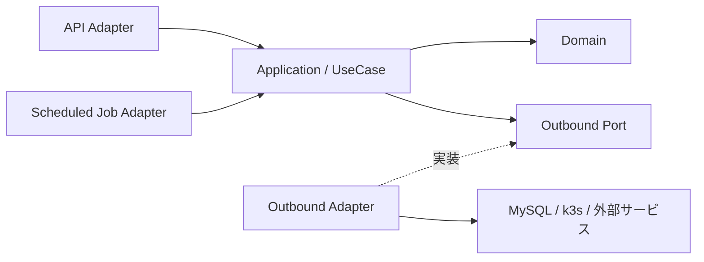

# アーキテクチャ

Nioraの現在のシステム構成、境界、依存関係を示します。

このファイルには現在採用している構成だけを記載します。判断の背景、代替案、影響、変更履歴は[アーキテクチャ決定記録（ADR）](adr/README.md)で管理します。

## 全体構成

全体をモジュラーモノリスとして構成し、APIと期限切れ削除Jobは同じコードベースとビルド成果物を利用します。詳細は[ADR 0003](adr/0003-use-modular-monolith.md)を参照してください。

## モジュール境界

Niora APIを次のドメインモジュールに分割します。

| モジュール | 責務 |
| --- | --- |
| `Textbook` | 教科書と章 |
| `Workspace` | WorkspaceDefinition、Workspaceのライフサイクルと接続 |
| `Auth` | 外部認証との連携、利用者、権限 |

`Auth`は全体構成に含めますが、v0.0.1では実装しません。モジュール間は公開されたApplicationインターフェースを通じて連携します。

## 依存関係

各モジュールはクリーンアーキテクチャの依存性ルールに従います。

DomainとApplicationは外部技術に依存せず、MySQL、k3s、外部認証、接続方式との差分をAdapterで吸収します。詳細は[ADR 0004](adr/0004-use-clean-architecture.md)を参照してください。

## データ

教科書、章、WorkspaceDefinitionなどの永続データにはMySQL 9.7 LTSを使用します。各モジュールは同じデータベースを利用し、データの所有境界を分けます。詳細は[ADR 0005](adr/0005-use-mysql-9.7-lts.md)を参照してください。

Workspaceの実行状態はデータベースへ保存せず、k3s上のリソースを正とします。

## k3s

| Namespace | 配置するもの |
| --- | --- |
| `ns-niora-service` | フロントエンド、Niora API、MySQL、期限切れ削除CronJob |
| `ns-niora-workspaces` | Workspaceを構成するPod群と付随するリソース |

すべてのWorkspaceは`ns-niora-workspaces`を共有し、LabelとNetworkPolicyでWorkspace間の通信を分離します。詳細は[ADR 0006](adr/0006-share-k3s-workspace-namespace.md)を参照してください。

WorkspaceはWorkspaceDefinitionに従って1つ以上のPodと必要なService、NetworkPolicyで構成します。Niora APIが起動、状態確認、接続、削除を行い、期限切れ削除Jobが有効期限を過ぎたWorkspaceを削除します。

ブラウザとNiora APIの間はWebSocket、Niora APIとWorkspaceの間はk3s APIのPod `exec`で接続します。接続が切断されてもWorkspaceは維持します。詳細は[ADR 0007](adr/0007-run-workspaces-as-pods.md)を参照してください。

## 外部との境界

- 利用者からバックエンド機能へのアクセスはNiora APIを経由する
- MySQLとk3s APIを利用者へ公開しない
- Workspaceへの接続をNiora APIが中継する
- Workspace間の通信を禁止し、同じWorkspace内のPod間通信を許可する
- Workspaceからインターネットへの通信を許可し、Nioraの基盤への通信を禁止する
